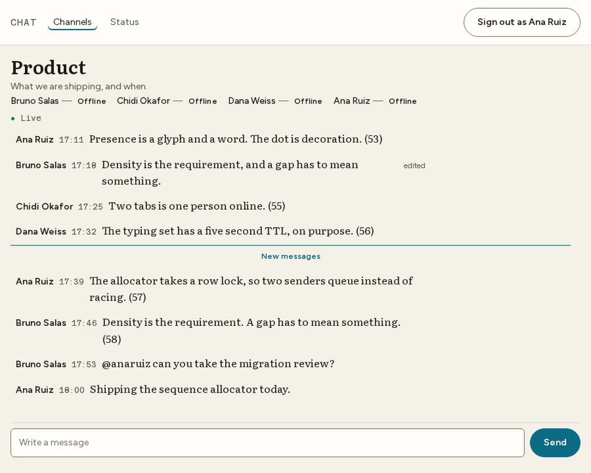
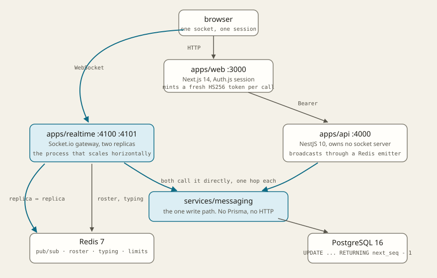

# Chat: a conversation several people can hold at once, through several servers

[](https://github.com/bastian-red/chat-app/actions/workflows/ci.yml)

Public and private channels, direct messages, presence, typing indicators, paginated
history and file uploads. Next.js 14, NestJS 10 and a Socket.io gateway over PostgreSQL 16
and Redis 7, in a pnpm/Turborepo monorepo.

The named challenge is **horizontal WebSocket scaling with Redis pub/sub and ordered
message delivery**, and those are two problems of very different sizes. Scaling is an
afternoon: wire `@socket.io/redis-adapter` and a message sent through one gateway reaches a
client on another. Ordering is the hard one, and it is what this repository is actually
about.





## Why timestamps cannot order a conversation

Two API processes disagree about `now()` by milliseconds. NTP steps clocks backwards. A tie
in a timestamp is a coin flip about what a conversation said. So order does not come from a
clock here; it comes from Postgres:

```sql
-- packages/db/src/messaging-repository.ts, inside the send transaction
UPDATE channels SET next_seq = next_seq + 1
WHERE id = $1
RETURNING next_seq - 1 AS seq
```

One statement. It takes a row lock for the length of the transaction, so concurrent senders
**queue** instead of racing, and the allocation and the insert share that transaction, so a
crash between them rolls the number back rather than burning it.

The sequence is **dense**: 1, 2, 3, with no gaps and no room between two of them. That is
the requirement rather than a simplification. "Have I missed anything?" is answerable only
if the absence of `n + 1` means something, and a scheme with room between keys (a
fractional index, say) can never answer it. Density is also why a delete is a tombstone:
the row keeps its seq and loses its body, because a hole is indistinguishable from a
message a client has not received yet, and a hard delete would send every reader into a
permanent catch-up loop.

Everything else follows from that one decision. `lastReadSeq` counts from 0 while `seq`
counts from 1, so "read nothing" and "read the first message" are different values. Unread
counts are `nextSeq - 1 - lastReadSeq`, computed on every read and never stored, because
storing them means two writers for one fact and every unread-counter bug in every chat
product is those two disagreeing.

## The six properties, and the test that proves each

| #   | Property                                                | Where it lives                                                       | What proves it                                                                                                                     |
| --- | ------------------------------------------------------- | -------------------------------------------------------------------- | ---------------------------------------------------------------------------------------------------------------------------------- |
| 1   | 24 simultaneous senders get exactly the seq set `1..24` | the row lock in `allocateSeq`                                        | fires 24 concurrent sends at one channel; every seq distinct, no gap, `next_seq` left at 25, every body stored once                |
| 2   | A message sent on `:4100` reaches a client on `:4101`   | `@socket.io/redis-adapter` over two separate processes               | deleting `io.adapter(...)` turns **5** integration specs red and leaves the other 45 green, including the concurrency proof        |
| 3   | A resend after a dropped ack is not a second message    | `@@unique([channelId, clientMessageId])`, caught rather than avoided | the same client id sent twice **concurrently** yields one row; one answer carries `duplicate: true` and the same seq               |
| 4   | The roster forgets somebody who stopped heartbeating    | a per-field timestamp in a Redis hash, swept on read                 | a client closes without leaving; the roster drops them within `PRESENCE_TTL_SECONDS`, against a real Redis                         |
| 5   | A reconnect catches up with no gap and no duplicate     | `services/sequencing` + `channel.catchup`, bounded                   | a second browser context goes offline, three messages are sent, it comes back: all three arrive, each exactly once                 |
| 6   | Every state is legible with no colour perception at all | `presence-words.ts`, and words beside every dot                      | the gate lane asserts light `online` and `offline` are **the same pixel** (1.00 contrast), which is why the word carries the state |

## The one that is easy to fake

Property 2 is the one a single-process test cannot see. With one gateway every socket
shares one in-memory adapter, so broadcasts work perfectly whether or not the Redis adapter
is wired at all. `scripts/integration.sh` therefore starts **two** gateway processes, on
4100 and 4101, and the assertion is that a client connected to one receives a message sent
through the other.

That proof has been performed, not assumed. Commenting out the adapter:

```
### WITHOUT the Redis adapter
 ✓ test/api.integration.test.ts (31 tests)
 ❯ test/realtime.integration.test.ts (14 tests | 5 failed)
   × cross-replica broadcast > delivers a message sent on gateway 1 to a client on gateway 2
   × cross-replica broadcast > reaches a member who has the channel closed, through their user room
   × presence and typing > puts a joiner on the roster and tells the others
   × presence and typing > forgets a client that stops heartbeating, within the TTL
   × presence and typing > broadcasts the complete typing set, not a delta
 ✓ test/sequence.integration.test.ts (5 tests)
      Tests  5 failed | 45 passed (50)
```

The concurrency proof stays green, which is the point: it is a property of the database and
has nothing to do with the transport.

## Two write paths, one write

```
                    ┌──────────────┐
   browser ────────▶│  apps/web    │  Next.js 14, Auth.js session
      │             │  :3000       │  mints a fresh HS256 service token per call
      │             └──────┬───────┘
      │ WebSocket          │ HTTP + Bearer
      ▼                    ▼
┌──────────────┐    ┌──────────────┐
│apps/realtime │    │  apps/api    │  NestJS 10, owns no Socket.io server
│  :4100 :4101 │    │  :4000       │  broadcasts through a Redis *emitter*
└──────┬───────┘    └──────┬───────┘
       │                   │
       │  both call        ▼
       └──────────▶ services/messaging ──▶ packages/db ──▶ PostgreSQL
                    (the write path)       (Prisma adapter)
       │
       └──────────▶ Redis ─── pub/sub adapter (replica ↔ replica)
                         ├── presence roster + typing sets
                         └── rate limiting
```

**The gateway is not a thin relay in front of the API.** A socket send costs one hop:
socket, gateway, Postgres. Forwarding to the API would cost two and put an HTTP round
trip inside the latency budget of every message.

The cost of that choice is that two processes now write, so two processes must broadcast
identically, and the failure mode when they do not is silent. The write succeeds, the emit
succeeds, and the other person's conversation simply stops updating, which from the outside
is indistinguishable from a dropped socket. So `packages/shared/src/broadcast.ts` owns the
mapping: it takes a structural `RoomEmitter` (satisfied by both Socket.io's `Server` and
`@socket.io/redis-emitter`'s `Emitter`, neither of which is a dependency of `@chat/shared`)
and builds every wire payload itself. A caller hands it domain objects, never an envelope.

| Package               | What it owns                                                               |
| --------------------- | -------------------------------------------------------------------------- |
| `apps/web`            | Next.js app, the conversation, one socket, the design system               |
| `apps/api`            | REST: auth, channels, history, uploads, `/health`. Holds no socket server  |
| `apps/realtime`       | Socket.io gateway; the process that scales horizontally                    |
| `services/messaging`  | the write path: permissions, idempotency, read markers. No Prisma, no HTTP |
| `services/presence`   | the Redis roster and typing sets: connection-keyed, collapsed on read      |
| `services/sequencing` | the client's reorder buffer. A pure state machine, zero I/O                |
| `packages/shared`     | contracts, the socket protocol, the role matrix, room names, time helpers  |
| `packages/db`         | Prisma schema, the invariants migration, the adapter, the seed             |

## Three things the schema does that the code cannot

Everything Prisma cannot express lives in `20260811090000_chat_invariants`:

- **`UNIQUE (channel_id, seq)`.** Two messages at one seq is two clients disagreeing about
  what the conversation said, permanently.
- **`channel_members_one_owner_per_channel`**, a partial unique index, which is the only way to say
  "at most one row per channel where role = OWNER" in Postgres. There is no `owner_id`
  column: the owner _is_ the membership, so "who may delete this channel" is a query, and a
  query with two answers is a permission check that depends on row order. A DM has zero
  owners, because neither participant may remove the other.
- **`messages_body_not_blank`**, written to exempt exactly the tombstone case.

Code that catches a violation matches on the **constraint name**, never on the message
text: Postgres localises and rewords those between versions, so a
`String(error).includes('duplicate key')` stops working on a server with a different locale
and reports a resend as a 500. The names are exported from `packages/db/src/index.ts` for
this, and `errors.test.ts` pins all three shapes Prisma reports them in, including the one
with no code at all, where the SQLSTATE is quoted inside the connector's own text.

## Presence cannot be a colour

The three status colours clear WCAG AA against the canvas individually and are useless
against each other. Measured from the real stylesheet, in the gate lane:

| Pair                 | Light    | Dark |
| -------------------- | -------- | ---- |
| `online` / `away`    | 1.10     | 1.01 |
| `online` / `offline` | **1.00** | 1.28 |

A ratio of 1.00 means identical relative luminance: to a reader with deuteranopia, or to
anyone on a greyscale display, light-mode `online` and `offline` are the same pixel.

So presence carries a **glyph and a word**, and the dot is decoration. The glyph shapes
differ (filled, hollow, dash) rather than being one shape in three colours, and it is
`aria-hidden` because the word already says it. All three strings come from
`packages/shared/src/presence-words.ts`: one implementation, because a screen-reader user
hearing "Ana Ruiz, online" while a sighted colleague reads "Ana (available)" is two
descriptions of one fact.

`apps/web/lib/contrast.test.ts` asserts that collision **deliberately**, so the reason for
the design stays in the test suite rather than becoming folklore: the moment somebody
"improves" the palette so the three separate, the argument for the word looks unnecessary
and the next person deletes it.

The same rule runs through everything stateful: unread is a count and a label, a mention is
a marker and a label, an edited message says "edited", and `/status` says "OK" rather than
showing a green pill.

## Running it

Needs Node 20, pnpm 9 and Docker.

```bash
git clone https://github.com/bastian-red/chat-app.git
cd chat-app
pnpm install

cp .env.example .env
sed -i "s|^AUTH_SECRET=|AUTH_SECRET=$(openssl rand -base64 32)|" .env

docker compose -f infra/docker-compose.yml up -d      # Postgres 5438, Redis 6385
pnpm db:generate && pnpm db:deploy && pnpm db:seed
pnpm dev
```

Then open <http://localhost:3000> and sign in as `ana@chat.test` / `demo-password-2026`.
Open the same channel in a second browser to watch a message cross.

The seed plants four people in three channels, because the role matrix is a feature and one
account cannot demonstrate it: Ana owns `#product`, Bruno is an admin there and owns
`#incidents`, and the DM between them has no owner at all. It writes 60 messages into
`#product`, more than one page, so the keyset paginator has a boundary to cross, and it
leaves Ana four messages behind with one mention among them, so the unread counts are
non-zero and visible.

**`pnpm dev` points at `scripts/dev.sh`, not at `turbo run dev`, and that is
load-bearing.** Turbo does not read `.env`, and Turborepo 2 runs in strict environment
mode: only names declared in `turbo.json` reach a task's child process, and everything else
is stripped silently. Three sibling projects in this portfolio shipped with a short list
there, which meant `pnpm dev` started an API with no `AUTH_SECRET` and every server render
died with `ECONNREFUSED`. `scripts/env-contract.mjs` fails the build if the source,
`.env.example` and `turbo.json` disagree in any of four directions, and
`scripts/dev-smoke.sh` boots the real `pnpm dev` with **every** `.env` name stripped from
its environment, then asserts that a seeded conversation arrives over a socket with usable
sequence numbers on it.

To run the whole stack from images instead, including the second gateway replica:

```bash
docker compose -f infra/docker-compose.yml --profile app up -d --build
```

## Testing

Five lanes, different budgets.

```bash
pnpm test                  # gate lane: 489 unit tests, no network, no database
pnpm env:contract          # the environment contract, free and instant
pnpm scan:invisible        # a character you cannot see is a bug you cannot review
./scripts/dev-smoke.sh     # boots the documented `pnpm dev` and asserts a live conversation
./scripts/integration.sh   # real Postgres, real Redis, TWO gateway processes
./scripts/e2e.sh           # Playwright: Chromium + Firefox, including axe on every route
```

| Lane        | Count     | What only it can prove                                                    |
| ----------- | --------- | ------------------------------------------------------------------------- |
| Unit        | 489       | the reorder buffer, the role matrix, DM keys, TTL arithmetic, the palette |
| Environment | 1         | every name the code reads is declared and documented, in four directions  |
| Dev smoke   | 1         | the README's own command produces a working, live app                     |
| Integration | 50        | concurrency, idempotency, cross-replica delivery, TTLs, schema invariants |
| E2E         | 2 engines | the flows a person performs, two contexts at once, zero axe violations    |

Three things this suite does deliberately:

- **Assertions are on content, never on a status code.** A broken app answers 200 with an
  error page, which is exactly what a missing `AUTH_SECRET` produces.
- **The expected values are computed, not recalled.** Every contrast ratio, every locale
  string and every clock time in an assertion was run first and pasted. A wrong expectation
  does not merely fail; it invites you to "fix" correct code until the test passes.
- **Every proof has been shown to fail.** The Redis adapter, the eslint event-name rule, the
  presence connection counting, the `INVALID` message that must not leak zod's issues, and
  the `turbo.json` declaration were each reverted and the corresponding lane watched go red
  before being restored. Removing `AUTH_SECRET` from `globalPassThroughEnv` makes
  `dev-smoke.sh` report `api (:4000) never came up`, which is the outage it exists for.

## Configuration

Every name is documented in `.env.example` and declared in `turbo.json`; the contract check
fails if those two and the source ever disagree. The ones worth knowing:

| Variable                  | Default | Why it is a knob                                                                                                                                                      |
| ------------------------- | ------- | --------------------------------------------------------------------------------------------------------------------------------------------------------------------- |
| `HISTORY_PAGE_SIZE`       | 40      | messages per page, read by keyset on `seq` and never by OFFSET: a message arriving mid-scroll must not shift the page under the reader's thumb                        |
| `CATCHUP_MAX_MESSAGES`    | 200     | above this a reconnect answers `complete: false` and the client **reloads** rather than splicing. Streaming a week of backlog is how a gateway dies                   |
| `PRESENCE_TTL_SECONDS`    | 25      | must be **more than twice** `PRESENCE_HEARTBEAT_SECONDS`, or one dropped packet marks somebody offline who is still reading. Both processes refuse to start otherwise |
| `TYPING_TTL_SECONDS`      | 5       | short on purpose: an indicator that outlives the typing is a lie about who is in the conversation                                                                     |
| `SOCKET_EVENT_RATE_LIMIT` | 240     | events per minute per socket, in process memory rather than Redis: a socket lives on exactly one replica for its whole life                                           |
| `UPLOAD_MAX_BYTES`        | 10 MB   | enforced by counting bytes **while streaming**, never by trusting `Content-Length`                                                                                    |
| `PORT`                    | unset   | wins over `REALTIME_PORT` and `API_PORT`. It is what lets compose run a second gateway replica on 4101 out of the image the first one built                           |

## Not deployed, on purpose

This is one of thirteen portfolio projects, all published to GitHub and hosted nowhere.
Free tiers do not stretch to thirteen deploys and paying for them buys nothing this
repository does not already show. What survives instead is the evidence that the thing is
operable: a real `/health` on both services that checks its dependencies rather than its own
pulse, a `/status` page fed by the same endpoints that probes **both** gateway replicas, a
Dockerfile per service, a compose file that brings the whole stack up including that second
replica, and CI that runs every lane above on every push.

The gateway's health check is the one worth reading. It does not ping Redis; it publishes a
nonce on the Socket.io adapter's own two connections and waits to receive it back. A gateway
whose subscriber has silently stopped receiving serves every socket it holds perfectly well
and stops relaying to the other replica. From inside that process nothing is wrong, and
from a user's seat half the people in the channel stopped talking. A liveness probe cannot
see it.
